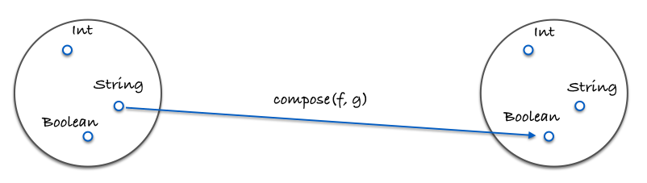

# Bab 05: Pengodean dengan Composing

## Peternakan Fungsional
Berikut `compose` nya:

```js
const compose = (f, g) => x => f(g(x));
```

`f` dan `g` adalah fungsi dan `x` adalah nilai yang "disalurkan" melalui mereka.

Komposisi terasa seperti fungsi peternakan. Anda, sebagai peternak fungsi, memilih dua dengan ciri-ciri yang ingin Anda gabungkan dan mash bersama-sama untuk menelurkan yang baru. Penggunaannya adalah sebagai berikut:

```js
const toUpperCase = x => x.toUpperCase();
const exclaim = x => `${x}!`;
const shout = compose(exclaim, toUpperCase);

shout('send in the clowns'); // "SEND IN THE CLOWNS!"
```

Komposisi dua fungsi mengembalikan fungsi baru. Ini masuk akal: menyusun dua unit dari beberapa jenis (dalam hal ini fungsi) harus menghasilkan unit baru dari jenis itu. Anda tidak memasang dua lego bersamaan lalu dapatkan log lincoln. Ada sebuah teori di sini, beberapa hukum dasar yang akan kita temukan pada waktunya.

Dalam definisi `compose` kami, `g` akan berjalan sebelum `f`, membuat arus data dari kanan menjadi ke kiri. Ini jauh lebih mudah dibaca daripada menyarangkan sekumpulan panggilan fungsi. Tanpa menulis, hal di atas akan menjadi:

```js
const shout = x => exclaim(toUpperCase(x));
```

Sebagai ganti dari dalam ke luar, kita menjalankan kanan ke kiri, yang saya rasa merupakan langkah ke arah kiri (mengusir). Mari kita lihat contoh di mana urutannya penting:

```js
const head = x => x[0];
const reverse = reduce((acc, x) => [x].concat(acc), []);
const last = compose(head, reverse);

last(['jumpkick', 'roundhouse', 'uppercut']); // 'uppercut'
```

`reverse` akan mengubah daftar sekitar sementara `head` mendapatkan item awal. Hal ini menghasilkan fungsi `last` yang efektif, meskipun tidak efisien. Urutan fungsi dalam komposisi harus terlihat di sini. Kita bisa mendefinisikan versi kiri ke kanan, bagaimanapun, kita cermati versi matematis jauh lebih dekat saat ia berdiri. Itu benar, komposisi langsung dari buku matematika. Sebenarnya, mungkin sudah waktunya melihat properti yang menampung komposisi apapun.

```js
// associativity
compose(f, compose(g, h)) === compose(compose(f, g), h);
```

Komposisi bersifat asosiatif, artinya tidak masalah bagaimana Anda mengelompokkan mereka menjadi dua. Jadi, jika kita memilih untuk huruf besar, kita bisa menulis:

```js
compose(toUpperCase, compose(head, reverse));
// atau
compose(compose(toUpperCase, head), reverse);
```

Karena tidak masalah bagaimana kita mengelompokkan panggilan kita ke `compose`, hasilnya akan sama. Itu memungkinkan kita menulis komposisi variadik dan menggunakannya sebagai berikut:

```js
// sebelumnya kita harus menulis dua composes, tapi karena itu asosiatif,
// kita bisa memberikan sebanyak mungkin yang kita inginkan dan membiarkannya 
const arg = ['jumpkick', 'roundhouse', 'uppercut'];
const lastUpper = compose(toUpperCase, head, reverse);
const loudLastUpper = compose(exclaim, toUpperCase, head, reverse);

lastUpper(arg); // 'UPPERCUT'
loudLastUpper(arg); // 'UPPERCUT!'
```

Menerapkan properti asosiatif memberi kita fleksibilitas dan ketenangan berpikir bahwa ini hasilnya akan setara. Variasi variadik yang sedikit lebih rumit disertakan dengan perpustakaan pendukung untuk buku ini dan merupakan definisi normal yang akan Anda temukan di perpustakaan seperti [lodash][lodash-website], [underscore][underscore-website], dan [ramda][ ramda-website].

Satu manfaat yang menyenangkan dari associativity adalah bahwa setiap kelompok fungsi dapat diekstraksi dan digabungkan bersama dalam komposisi mereka sendiri. Mari bermain dengan contoh refactoring sebelumnya:

```js
const loudLastUpper = compose(exclaim, toUpperCase, head, reverse);

// -- atau ---------------------------------------------------------------

const last = compose(head, reverse);
const loudLastUpper = compose(exclaim, toUpperCase, last);

// -- atau ---------------------------------------------------------------

const last = compose(head, reverse);
const angry = compose(exclaim, toUpperCase);
const loudLastUpper = compose(angry, last);

// lebih banyak variasi...
```

Tidak ada jawaban benar atau salah - kami hanya memasukkan lego bersamaan dengan cara apa pun yang kami inginkan. Biasanya yang terbaik adalah mengelompokkan barang dengan cara yang bisa digunakan kembali seperti `last` dan `angry`. Jika akrab dengan "[Refactoring][refactoring-book]" Fowler, orang mungkin akan mengenali proses ini sebagai "[metode ekstrak][extract-method-refactor]"...kecuali tanpa semua objek yang perlu dikhawatirkan.

## Pointfree

Pointfree style means never having to say your data. Excuse me. It means functions that never mention the data upon which they operate. First class functions, currying, and composition all play well together to create this style.

> Hint: Pointfree versions of `replace` & `toLowerCase` are defined in the [Appendix C -
> Pointfree Utilities](./appendix_c.md). Do not hesitate to have a peek!

```js
// not pointfree because we mention the data: word
const snakeCase = word => word.toLowerCase().replace(/\s+/ig, '_');

// pointfree
const snakeCase = compose(replace(/\s+/ig, '_'), toLowerCase);
```

See how we partially applied `replace`? What we're doing is piping our data through each function of 1 argument. Currying allows us to prepare each function to just take its data, operate on it, and pass it along. Something else to notice is how we don't need the data to construct our function in the pointfree version, whereas in the pointful one, we must have our `word` available before anything else.

Let's look at another example.

```js
// not pointfree because we mention the data: name
const initials = name => name.split(' ').map(compose(toUpperCase, head)).join('. ');

// pointfree
const initials2 = compose(join('. '), map(compose(toUpperCase, head)), split(' '));

initials('hunter stockton thompson'); // 'H. S. T'
```

Pointfree code can again, help us remove needless names and keep us concise and generic. Pointfree is a good litmus test for functional code as it lets us know we've got small functions that take input to output. One can't compose a while loop, for instance. Be warned, however, pointfree is a double-edged sword and can sometimes obfuscate intention. Not all functional code is pointfree and that is O.K. We'll shoot for it where we can and stick with normal functions otherwise.

## Debugging
A common mistake is to compose something like `map`, a function of two arguments, without first partially applying it.

```js
// wrong - we end up giving angry an array and we partially applied map with who knows what.
const latin = compose(map, angry, reverse);

latin(['frog', 'eyes']); // error

// right - each function expects 1 argument.
const latin = compose(map(angry), reverse);

latin(['frog', 'eyes']); // ['EYES!', 'FROG!'])
```

If you are having trouble debugging a composition, we can use this helpful, but impure trace function to see what's going on.

```js
const trace = curry((tag, x) => {
  console.log(tag, x);
  return x;
});

const dasherize = compose(
  join('-'),
  toLower,
  split(' '),
  replace(/\s{2,}/ig, ' '),
);

dasherize('The world is a vampire');
// TypeError: Cannot read property 'apply' of undefined
```

Something is wrong here, let's `trace`

```js
const dasherize = compose(
  join('-'),
  toLower,
  trace('after split'),
  split(' '),
  replace(/\s{2,}/ig, ' '),
);

dasherize('The world is a vampire');
// after split [ 'The', 'world', 'is', 'a', 'vampire' ]
```

Ah! We need to `map` this `toLower` since it's working on an array.

```js
const dasherize = compose(
  join('-'),
  map(toLower),
  split(' '),
  replace(/\s{2,}/ig, ' '),
);

dasherize('The world is a vampire'); // 'the-world-is-a-vampire'
```

The `trace` function allows us to view the data at a certain point for debugging purposes. Languages like haskell and purescript have similar functions for ease of development.

Composition will be our tool for constructing programs and, as luck would have it, is backed by a powerful theory that ensures things will work out for us. Let's examine this theory.


## Category Theory

Category theory is an abstract branch of mathematics that can formalize concepts from several different branches such as set theory, type theory, group theory, logic, and more. It primarily deals with objects, morphisms, and transformations, which mirrors programming quite closely. Here is a chart of the same concepts as viewed from each separate theory.


Sorry, I didn't mean to frighten you. I don't expect you to be intimately familiar with all these concepts. My point is to show you how much duplication we have so you can see why category theory aims to unify these things.

In category theory, we have something called... a category. It is defined as a collection with the following components:

  * A collection of objects
  * A collection of morphisms
  * A notion of composition on the morphisms
  * A distinguished morphism called identity

Category theory is abstract enough to model many things, but let's apply this to types and functions, which is what we care about at the moment.

**A collection of objects**
The objects will be data types. For instance, ``String``, ``Boolean``, ``Number``, ``Object``, etc. We often view data types as sets of all the possible values. One could look at ``Boolean`` as the set of `[true, false]` and ``Number`` as the set of all possible numeric values. Treating types as sets is useful because we can use set theory to work with them.


**A collection of morphisms**
The morphisms will be our standard every day pure functions.

**A notion of composition on the morphisms**
This, as you may have guessed, is our brand new toy - `compose`. We've discussed that our `compose` function is associative which is no coincidence as it is a property that must hold for any composition in category theory.

Here is an image demonstrating composition:




Here is a concrete example in code:

```js
const g = x => x.length;
const f = x => x === 4;
const isFourLetterWord = compose(f, g);
```

**A distinguished morphism called identity**
Let's introduce a useful function called `id`. This function simply takes some input and spits it back at you. Take a look:

```js
const id = x => x;
```

You might ask yourself "What in the bloody hell is that useful for?". We'll make extensive use of this function in the following chapters, but for now think of it as a function that can stand in for our value - a function masquerading as every day data.

`id` must play nicely with compose. Here is a property that always holds for every unary (unary: a one-argument function) function f:

```js
// identity
compose(id, f) === compose(f, id) === f;
// true
```

Hey, it's just like the identity property on numbers! If that's not immediately clear, take some time with it. Understand the futility. We'll be seeing `id` used all over the place soon, but for now we see it's a function that acts as a stand in for a given value. This is quite useful when writing pointfree code.

So there you have it, a category of types and functions. If this is your first introduction, I imagine you're still a little fuzzy on what a category is and why it's useful. We will build upon this knowledge throughout the book. As of right now, in this chapter, on this line, you can at least see it as providing us with some wisdom regarding composition - namely, the associativity and identity properties.

What are some other categories, you ask? Well, we can define one for directed graphs with nodes being objects, edges being morphisms, and composition just being path concatenation. We can define with Numbers as objects and `>=` as morphisms (actually any partial or total order can be a category). There are heaps of categories, but for the purposes of this book, we'll only concern ourselves with the one defined above. We have sufficiently skimmed the surface and must move on.


## In Summary
Composition connects our functions together like a series of pipes. Data will flow through our application as it must - pure functions are input to output after all, so breaking this chain would disregard output, rendering our software useless.

We hold composition as a design principle above all others. This is because it keeps our app simple and reasonable. Category theory will play a big part in app architecture, modelling side effects, and ensuring correctness.

We are now at a point where it would serve us well to see some of this in practice. Let's make an example application.

[Chapter 06: Example Application](ch06.md)

## Exercises

In each following exercise, we'll consider Car objects with the following shape:

```js
{
  name: 'Aston Martin One-77',
  horsepower: 750,
  dollar_value: 1850000,
  in_stock: true,
}
```


  
Use `compose()` to rewrite the function below.  
  
  
```js  
const isLastInStock = (cars) => {  
  const lastCar = last(cars);  
  return prop('in_stock', lastCar);  
};  
```  
  
  
  
  
  


---


Considering the following function:

```js
const average = xs => reduce(add, 0, xs) / xs.length;
```

  
Use the helper function `average` to refactor `averageDollarValue` as a composition.  
  
  
```js  
const averageDollarValue = (cars) => {  
  const dollarValues = map(c => c.dollar_value, cars);  
  return average(dollarValues);  
};  
```  
  
  
  
  
  


---


  
Refactor `fastestCar` using `compose()` and other functions in pointfree-style. Hint, the  
`flip` function may come in handy.  
  
  
```js  
const fastestCar = (cars) => {  
  const sorted = sortBy(car => car.horsepower);  
  const fastest = last(sorted);  
  return concat(fastest.name, ' is the fastest');  
};  
```  
  
  
  
  
  

[lodash-website]: https://lodash.com/
[underscore-website]: http://underscorejs.org/
[ramda-website]: http://ramdajs.com/
[refactoring-book]: http://martinfowler.com/books/refactoring.html
[extract-method-refactor]: http://refactoring.com/catalog/extractMethod.html
