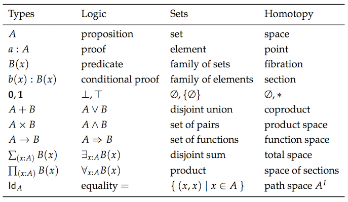

# Bab 05: Pengodean dengan Composing

## Peternakan Fungsional
Berikut `compose` nya:

```js
const compose = (f, g) => x => f(g(x));
```

`f` dan `g` adalah fungsi dan `x` adalah nilai yang "disalurkan" melalui mereka.

Komposisi terasa seperti fungsi peternakan. Anda, sebagai peternak fungsi, memilih dua dengan ciri-ciri yang ingin Anda gabungkan dan mash bersama-sama untuk menelurkan yang baru. Penggunaannya adalah sebagai berikut:

```js
const toUpperCase = x => x.toUpperCase();
const exclaim = x => `${x}!`;
const shout = compose(exclaim, toUpperCase);

shout('send in the clowns'); // "SEND IN THE CLOWNS!"
```

Komposisi dua fungsi mengembalikan fungsi baru. Ini masuk akal: menyusun dua unit dari beberapa jenis (dalam hal ini fungsi) harus menghasilkan unit baru dari jenis itu. Anda tidak memasang dua lego bersamaan lalu dapatkan log lincoln. Ada sebuah teori di sini, beberapa hukum dasar yang akan kita temukan pada waktunya.

Dalam definisi `compose` kami, `g` akan berjalan sebelum `f`, membuat arus data dari kanan menjadi ke kiri. Ini jauh lebih mudah dibaca daripada menyarangkan sekumpulan panggilan fungsi. Tanpa menulis, hal di atas akan menjadi:

```js
const shout = x => exclaim(toUpperCase(x));
```

Sebagai ganti dari dalam ke luar, kita menjalankan kanan ke kiri, yang saya rasa merupakan langkah ke arah kiri (mengusir). Mari kita lihat contoh di mana urutannya penting:

```js
const head = x => x[0];
const reverse = reduce((acc, x) => [x].concat(acc), []);
const last = compose(head, reverse);

last(['jumpkick', 'roundhouse', 'uppercut']); // 'uppercut'
```

`reverse` akan mengubah daftar sekitar sementara `head` mendapatkan item awal. Hal ini menghasilkan fungsi `last` yang efektif, meskipun tidak efisien. Urutan fungsi dalam komposisi harus terlihat di sini. Kita bisa mendefinisikan versi kiri ke kanan, bagaimanapun, kita cermati versi matematis jauh lebih dekat saat ia berdiri. Itu benar, komposisi langsung dari buku matematika. Sebenarnya, mungkin sudah waktunya melihat properti yang menampung komposisi apapun.

```js
// associativity
compose(f, compose(g, h)) === compose(compose(f, g), h);
```

Komposisi bersifat asosiatif, artinya tidak masalah bagaimana Anda mengelompokkan mereka menjadi dua. Jadi, jika kita memilih untuk huruf besar, kita bisa menulis:

```js
compose(toUpperCase, compose(head, reverse));
// atau
compose(compose(toUpperCase, head), reverse);
```

Karena tidak masalah bagaimana kita mengelompokkan panggilan kita ke `compose`, hasilnya akan sama. Itu memungkinkan kita menulis komposisi variadik dan menggunakannya sebagai berikut:

```js
// sebelumnya kita harus menulis dua composes, tapi karena itu asosiatif,
// kita bisa memberikan sebanyak mungkin yang kita inginkan dan membiarkannya 
const arg = ['jumpkick', 'roundhouse', 'uppercut'];
const lastUpper = compose(toUpperCase, head, reverse);
const loudLastUpper = compose(exclaim, toUpperCase, head, reverse);

lastUpper(arg); // 'UPPERCUT'
loudLastUpper(arg); // 'UPPERCUT!'
```

Menerapkan properti asosiatif memberi kita fleksibilitas dan ketenangan berpikir bahwa ini hasilnya akan setara. Variasi variadik yang sedikit lebih rumit disertakan dengan perpustakaan pendukung untuk buku ini dan merupakan definisi normal yang akan Anda temukan di perpustakaan seperti [lodash][lodash-website], [underscore][underscore-website], dan [ramda][ ramda-website].

Satu manfaat yang menyenangkan dari associativity adalah bahwa setiap kelompok fungsi dapat diekstraksi dan digabungkan bersama dalam komposisi mereka sendiri. Mari bermain dengan contoh refactoring sebelumnya:

```js
const loudLastUpper = compose(exclaim, toUpperCase, head, reverse);

// -- atau ---------------------------------------------------------------

const last = compose(head, reverse);
const loudLastUpper = compose(exclaim, toUpperCase, last);

// -- atau ---------------------------------------------------------------

const last = compose(head, reverse);
const angry = compose(exclaim, toUpperCase);
const loudLastUpper = compose(angry, last);

// lebih banyak variasi...
```

Tidak ada jawaban benar atau salah - kami hanya memasukkan lego bersamaan dengan cara apa pun yang kami inginkan. Biasanya yang terbaik adalah mengelompokkan barang dengan cara yang bisa digunakan kembali seperti `last` dan `angry`. Jika akrab dengan "[Refactoring][refactoring-book]" Fowler, orang mungkin akan mengenali proses ini sebagai "[metode ekstrak][extract-method-refactor]"...kecuali tanpa semua objek yang perlu dikhawatirkan.

## Pointfree

Gaya pointfree berarti tidak perlu mengatakan data Anda. Permisi. Ini berarti fungsi yang tidak pernah menyebutkan data tempat mereka beroperasi. Fungsi kelas satu, currying, dan komposisi semuanya bermain dengan baik untuk menciptakan gaya ini.

> Petunjuk: Versi pointfree dari `replace` & `toLowerCase` didefinisikan dalam [Lampiran C -
> Keperluan Pointfree](./appendix_c.md). Jangan ragu untuk melihatnya!

```js
// bukan pointfree karena kami menyebutkan data: kata
const snakeCase = kata => word.toLowerCase().replace(/\s+/ig, '_');

// pointfree
const snakeCase = compose(replace(/\s+/ig, '_'), toLowerCase);
```

Lihat bagaimana sebagian `replace` kita terapkan? Apa yang kita lakukan adalah memilah data kita melalui masing-masing fungsi dari 1 argumen. Currying memungkinkan kita untuk mempersiapkan setiap fungsi hanya untuk mengambil datanya, beroperasi di atasnya, dan menyebarkannya. Hal lain yang perlu diperhatikan adalah bagaimana kita tidak membutuhkan data untuk membangun fungsi kita dalam versi pointfree, sedangkan yang ada disini, kita harus memiliki `kata` kita tersedia sebelum yang lainnya.

Mari kita lihat contoh lain.

```js
// bukan pointfree karena kami menyebutkan data: nama
const initials = nama => name.split(' ').map(compose(toUpperCase, head)).join('. ');

// pointfree
const initials2 = compose(join('. '), map(compose(toUpperCase, head)), split(' '));

initials('hunter stockton thompson'); // 'H. S. T'
```

Kode pointfree lagi, bantu kami menghapus nama yang tidak perlu dan menjaga agar tetap singkat dan umum. Pointfree adalah tes lakmus yang baik untuk kode fungsional karena memungkinkan kita mengetahui bahwa kita memiliki fungsi kecil yang mengambil input untuk output. Seseorang tidak bisa menulis selagi masih disimpulkan, misalnya. Berhati-hatilah, bagaimanapun, pointfree adalah pedang bermata dua dan terkadang bisa memudarkan keinginan. Tidak semua kode fungsional adalah pointfree dan itu adalah O.K. Kita akan menembaknya di mana kita bisa dan tetap dengan fungsi normal.

## Men-debug
Kesalahan paling umum adalah menulis sesuatu seperti `map`, sebuah fungsi dari dua argumen, tanpa terlebih dahulu menerapkannya secara parsial.

```js
// salah - kita akhirnya memberikan angry pada sebuah array dan kita memetakan sebagian map dengan siapa yang mengetahuinya.
const latin = compose(map, angry, reverse);

latin(['frog', 'eyes']); // error

// benar - setiap fungsi memiliki 1 argumen.
const latin = compose(map(angry), reverse);

latin(['frog', 'eyes']); // ['EYES!', 'FROG!'])
```

Jika Anda mengalami masalah dalam men-debug komposisi, kita bisa menggunakan bantuan ini, tapi trace impure berfungsi untuk melihat apa yang terjadi

```js
const trace = curry((tag, x) => {
  console.log(tag, x);
  return x;
});

const dasherize = compose(
  join('-'),
  toLower,
  split(' '),
  replace(/\s{2,}/ig, ' '),
);

dasherize('The world is a vampire');
// TypeError: Tidak bisa membaca properti 'apply' yang tidak terdefinisi
```

Ada yang salah di sini, mari kita `trace`

```js
const dasherize = compose(
  join('-'),
  toLower,
  trace('after split'),
  split(' '),
  replace(/\s{2,}/ig, ' '),
);

dasherize('The world is a vampire');
// setelah split [ 'The', 'world', 'is', 'a', 'vampire' ]
```

Ah! Kita perlu me-`map` `toLower` ini karena bekerja pada sebuah array.

```js
const dasherize = compose(
  join('-'),
  map(toLower),
  split(' '),
  replace(/\s{2,}/ig, ' '),
);

dasherize('The world is a vampire'); // 'the-world-is-a-vampire'
```

Fungsi `trace` memungkinkan kita melihat data pada titik tertentu untuk tujuan men-debug. Bahasa seperti haskell dan purescript memiliki fungsi yang sama untuk kemudahan pengembangan.

Komposisi akan menjadi alat kita untuk membangun program dan, sebagai keberuntungan memilikinya, ia didukung oleh teori yang kuat yang memastikan segala sesuatu akan berjalan dengan baik. Mari kita periksa teori ini.


## Teori Kategori

Teori kategori adalah cabang abstrak matematika yang dapat memformalkan konsep dari beberapa cabang yang berbeda seperti teori himpunan, teori tipe, teori kelompok, logika, dan banyak lagi. Teori ini berkaitan dengan objek, morfisme, dan transformasi, yang mencerminkan pemrograman dengan cukup ketat. Berikut adalah bagan dari konsep yang sama seperti yang dilihat dari masing-masing teori yang terpisah.



Maaf, saya tidak bermaksud menakut-nakuti Anda. Saya tidak mengharapkan Anda untuk familiar dengan semua konsep ini. Maksud saya adalah menunjukkan seberapa banyak duplikasi yang kita miliki sehingga Anda dapat melihat mengapa teori kategori bertujuan untuk menyatukan hal-hal ini.

Dalam teori kategori, kita memiliki sesuatu yang disebut... sebuah kategori. Ini didefinisikan sebagai koleksi dengan komponen berikut:

  * Kumpulan benda
  * Kumpulan morfisme
  * Gagasan komposisi pada morfisme
  * Sebuah morfisme yang dibedakan disebut dengan identitas

Teori kategori cukup abstrak untuk memodelkan banyak hal, tapi mari kita terapkan pada jenis dan fungsi, itulah yang kita pedulikan saat ini.

**Kumpulan benda**
Objek akan menjadi tipe data. Misalnya, ``String``, ``Boolean``, ``Angka``, ``Objek``, dll. Kita sering melihat tipe data sebagai kumpulan semua nilai yang memungkinkan. Orang bisa melihat ``Boolean`` sebagai himpunan `[true, false]` dan ``Angka`` sebagai himpunan semua nilai numerik yang memungkinkan. Memperlakukan jenis sebagai set berguna karena kita dapat menggunakan teori set untuk bekerja dengan mereka.


**Kumpulan morfisme**
Morfisme akan menjadi standar kita pada setiap fungsi pure.

**Gagasan komposisi pada morfisme**
Ini, seperti dugaan Anda, adalah mainan baru kami - `compose`. Kami telah membahas bahwa fungsi `compose` kami adalah asosiatif yang bukan kebetulan karena merupakan properti yang harus dimiliki untuk komposisi dalam teori kategori.

Berikut adalah gambar yang menunjukkan komposisi:


Berikut adalah contoh konkret dalam kode:

```js
const g = x => x.length;
const f = x => x === 4;
const isFourLetterWord = compose(f, g);
```

**Sebuah morfisme yang dibedakan disebut dengan identitas**
Mari kita perkenalkan fungsi berguna yang disebut `id`. Fungsi ini hanya membutuhkan masukan dan mengeluarkannya pada Anda. Lihatlah:

```js
const id = x => x;
```

Anda mungkin bertanya pada diri sendiri "Apakah neraka yang berguna itu?". Kami akan memanfaatkan fungsi ini secara luas dalam bab-bab berikutnya, namun sekarang kami menganggapnya sebagai fungsi yang dapat menggantikan nilai kami - sebuah fungsi yang menyamar sebagai data setiap hari.

`id` harus digunakan dengan baik dengan compose. Berikut adalah properti yang selalu berlaku untuk setiap fungsi unary (unary: fungsi satu argumen) f:

```js
// identitas
compose(id, f) === compose(f, id) === f;
// benar
```

Hei, itu seperti identitas properti pada angka! Jika itu tidak jelas dengan segera, luangkan waktu demi itu. Pahami kegagalan. Kita akan melihat `id` segera digunakan di semua tempat, tapi untuk saat ini kita melihat ini adalah fungsi yang bertindak sebagai stand in untuk nilai tertentu. Ini cukup berguna saat menulis kode pointfree.

Jadi begitulah, kategori jenis dan fungsinya. Jika ini adalah pengenalan pertama Anda, saya membayangkan Anda masih sedikit kabur dalam kategori apa dan mengapa ini berguna. Kami akan membangun pengetahuan ini di seluruh buku ini. Sampai sekarang, di bab ini, pada baris ini, setidaknya Anda dapat melihatnya sebagai menyediakan kita beberapa kebijaksanaan mengenai komposisi - yaitu sifat asosiatif dan identitas.

Apa saja kategori lain yang Anda tanyakan? Nah, kita bisa mendefinisikan salah satu grafik terarah dengan node yang menjadi objek, bagian tepi menjadi morfisme, dan komposisi hanya merupakan serangkaian jalan. Kita dapat mendefinisikan dengan Angka sebagai objek dan `>=` sebagai morfisme (Sebenarnya order sebagian atau total bisa menjadi kategori). Ada banyak kategori, tapi untuk tujuan buku ini, kami hanya akan memperhatikan hal yang ditentukan di atas. Kita sudah menelusuri permulaan dan harus terus bergerak.


## Kesimpulan
Komposisi menghubungkan fungsi kita bersama seperti serangkaian pipa. Data akan mengalir melalui aplikasi kita karena - fungsi pure harus dimasukkan ke output setelah semuanya masuk, jadi melanggar rantai ini akan mengabaikan output, membuat perangkat lunak kita tidak berguna.

Kami mempertahankan komposisi sebagai prinsip desain diatas semua yang lain. Hal ini karena akan membuat aplikasi kita tetap sederhana dan masuk akal. Teori kategori akan memainkan peran besar dalam arsitektur aplikasi, memodelkan efek samping, dan memastikan kebenaran.

Sekarang kita berada pada titik di mana ia akan melayani kita dengan baik untuk melihat sebagian dari ini dalam praktik. Mari buat contoh aplikasi.

[Bab 06: Contoh Aplikasi](ch06.md)

## Latihan

Dalam setiap latihan berikut, kami akan memperhitungkan objek Mobil dengan bentuk sebagai berikut:

```js
{
  name: 'Aston Martin One-77',
  horsepower: 750,
  dollar_value: 1850000,
  in_stock: true,
}
```


  
Gunakan `compose()` untuk menulis ulang fungsi dibawah ini.  
  
  
```js  
const isLastInStock = (cars) => {  
  const lastCar = last(cars);  
  return prop('in_stock', lastCar);  
};  
```  
  
  
  
  
  


---


Pertahankan fungsi berikut:

```js
const average = xs => reduce(add, 0, xs) / xs.length;
```

  
Gunakan fungsi pembantu `rata-rata` untuk me-refactor `averageDollarValue` sebagai komposisi.
  
  
```js  
const averageDollarValue = (cars) => {  
  const dollarValues = map(c => c.dollar_value, cars);  
  return average(dollarValues);  
};  
```  
  
  
  
  
  


---


  
Refactor `fastestCar` menggunakan `compose()` dan fungsi lainnya dalam gaya pointfree. Petunjuk,  
fungsi `flip` function mungkin berguna.  
  
  
```js  
const fastestCar = (cars) => {  
  const sorted = sortBy(car => car.horsepower);  
  const fastest = last(sorted);  
  return concat(fastest.name, ' is the fastest');  
};  
```  
  
  
  
  
  

[situs-lodash]: https://lodash.com/
[situs-underscore]: http://underscorejs.org/
[situs-ramda]: http://ramdajs.com/
[buku-refactoring]: http://martinfowler.com/books/refactoring.html
[metode-ekstrak-refactor]: http://refactoring.com/catalog/extractMethod.html
