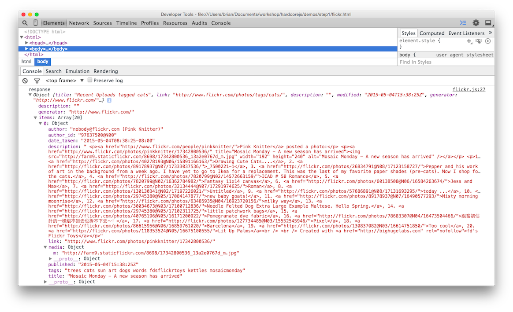

# Bab 06: Contoh Aplikasi

## Pengodean Deklaratif

Kita akan mengganti pola pikir kita. Dari sini, kita akan berhenti memberi tahu bagaimana komputer melakukan tugasnya dan sebaliknya menuliskan spesifikasi dari apa yang kita inginkan sebagai hasilnya. Saya yakin Anda akan merasa jauh lebih baik daripada mencoba micromanage sepanjang waktu.

Deklaratif, berlawanan dengan imperatif, berarti kita akan menulis ungkapan, yang berlawanan dengan instruksi langkah demi langkah.

Pikirkan tentang SQL. Tidak akan ada "lakukan ini pertama, lalu itu". Ada satu ekspresi yang menentukan tentang apa yang kita inginkan dari database. Kami tidak memutuskan bagaimana melakukan pekerjaan itu. Ketika database diupgrade dan SQL dioptimalkan, kita tidak perlu mengubah kueri kita. Ini karena ada banyak cara untuk menafsirkan spesifikasi kita dan mencapai hasil yang sama.

Bagi sebagian orang, termasuk saya, sulit memahami konsep pengkodean deklaratif pada awalnya jadi mari kita tunjukkan beberapa contoh untuk membuktikannya.

```js
// imperatif
const makes = [];
for (let i = 0; i < cars.length; i += 1) {
  makes.push(cars[i].make);
}

// deklaratif
const makes = cars.map(car => car.make);
```

Pertama-tama loop imperatif harus memberikan contoh array. Penerjemah harus mengevaluasi pernyataan ini sebelum melanjutkan. Kemudian langsung melewati daftar mobil, secara manual akan meningkatkan penghitung dan menunjukkan potongan-potongannya kepada kami dalam tampilan perulangan eksplisit yang jelas.

Versi `map` adalah salah satu ungkapan. Tidak memerlukan urutan evaluasi apapun. Ada banyak kebebasan di sini untuk bagaimana fungsi _map_ iterates dan bagaimana array yang dikembalikan dapat dirakit. Ini menentukan *apa*, bukan *bagaimana*. Dengan demikian, ia akan mengenakan sabuk deklaratif yang mengilap.

Selain menjadi lebih jelas dan ringkas, fungsi _map_ dapat dioptimalkan sesuka hati dan kode aplikasi berharga kami tidak perlu berubah.

Bagi Anda yang berpikir "Ya, tetapi akan lebih cepat menggunakan loop imperatif", saya sarankan anda mempelajari lagi tentang bagaimana JIT mengoptimalkan kode Anda. Berikut [video pencerahan yang hebat](https://www.youtube.com/watch?v=g0ek4vV7nEA)

Berikut contoh lainnya.

```js
// imperatif
const authenticate = (form) => {
  const user = toUser(form);
  return logIn(user);
};

// deklaratif
const authenticate = compose(logIn, toUser);
```

Meskipun tidak ada yang salah dengan versi imperatif, tetapi masih ada evaluasi langkah demi langkah yang dikodekan. Ungkapan `compose` hanya menyatakan sebuah fakta: Otentikasi adalah komposisi `toUser` dan `logIn`. Sekali lagi, ini melewatkan ruang gerak untuk perubahan kode pendukung dan berakibat pada kode aplikasi kita sebagai spesifikasi tingkat tinggi.

Pada contoh di atas, urutan evaluasi sudah ditentukan (`toUser` harus dipanggil sebelum `logIn`), namun ada banyak skenario dimana urutannya tidak penting, dan ini akan mudah ditentukan dengan pengkodean deklaratif (akan dijelaskan lebih lanjut nanti).

Karena kita tidak perlu mengkodekan urutan evaluasi, maka pengkodean deklaratif cocok untuk komputasi paralel. Ini disandingkan dengan fungsi _pure_ mengapa FP adalah pilihan yang tepat untuk paralel kedepannya - kita tidak perlu melakukan sesuatu yang istimewa untuk mencapai sistem bersama/paralel.

## Pemrograman Fungsional Flickr

Sekarang kita akan membuat sebuah contoh aplikasi dengan cara deklaratif, mudah digabungkan. Kami masih akan menipu dan menggunakan efek samping untuk saat ini, namun kami tetap mempertahankannya secara minimal dan terpisah dari basis kode _pure_ kami. Kita akan membuat widget browser yang menyebalkan menggunakan gambar flickr dan menampilkannya. Mari kita mulai dengan membangun aplikasi. Berikut htmlnya:


```html
<!doctype html>
<html lang="en">
  <head>
    <meta charset="utf-8">
    <title>Contoh Flickr</title>
  </head>
  <body>
    <main id="js-main" class="main"></main>
    <script src="https://cdnjs.cloudflare.com/ajax/libs/require.js/2.2.0/require.min.js"></script>
    <script src="main.js"></script>
  </body>
</html>
```

Dan ini kerangka main.js-nya:

```js
const CDN = s => `https://cdnjs.cloudflare.com/ajax/libs/${s}`;
const ramda = CDN('ramda/0.21.0/ramda.min');
const jquery = CDN('jquery/3.0.0-rc1/jquery.min');

requirejs.config({ paths: { ramda, jquery } });
require(['jquery', 'ramda'], ($, { compose, curry, map, prop }) => {
  // aplikasi disini
});
```

Kita memasangnya di [ramda](http://ramdajs.com) bukan di lodash atau beberapa perpustakaan utilitas lainnya. Ini termasuk `compose`, `curry`, dan lainnya. Saya telah menggunakan requirejs, yang mungkin tampak berlebihan, tapi kami akan menggunakannya di seluruh buku ini dan konsisten adalah kuncinya.

Nah, itu tidak masuk akal, untuk spec. Aplikasi kita akan melakukan 4 hal.

1. Membuat url untuk istilah pencarian kami
2. Membuat panggilan api flickr
3. Mengubah json yang dihasilkan menjadi gambar html
4. Menempatkannya di layar

Ada 2 tindakan _impure_ yang disebutkan di atas. Apakah anda melihatnya? Bit-bit itu adalah tentang mendapatkan data dari api flickr dan menempatkannya di layar. Mari kita definisikan dulu sehingga kita bisa mengarantina mereka. Dan juga, saya akan menambahkan fungsi `trace` yang bagus untuk memudahkan debugging.

```js
const Impure = {
  getJSON: curry((callback, url) => $.getJSON(url, callback)),
  setHtml: curry((sel, html) => $(sel).html(html)),
  trace: curry((tag, x) => { console.log(tag, x); return x; }),
};
```

Di sini kita hanya membungkus metode jQuery untuk menjadi _curried_ dan kita telah menukar argumen ke posisi yang lebih baik. Saya sudah menamai mereka dengan `Impure` jadi kita tahu ini adalah fungsi yang berbahaya. Pada contoh mendatang, kita akan membuat kedua fungsi ini menjadi _pure_.

Selanjutnya kita harus membuat sebuah url untuk diteruskan ke fungsi `Impure.getJSON` kita.

```js
const host = 'api.flickr.com';
const path = '/services/feeds/photos_public.gne';
const query = t => `?tags=${t}&format=json&jsoncallback=?`;
const url = t => `https://${host}${path}${query(t)}`;
```

Ada cara penulisan `url` yang bagus dan lebih kompleks menggunakan monoids (kita akan mempelajari ini nanti) atau combinator. Kami telah memilih untuk tetap menggunakan versi yang dapat dibaca dan merakit string ini dengan cara yang normal.

Mari kita tulis fungsi aplikasi untuk membuat panggilan dan menempatkan konten di layar.

```js
const app = compose(Impure.getJSON(Impure.trace('response')), url);
app('cats');
```

Ini akan memanggil fungsi `url` kita, lalu meneruskan string ke fungsi `getJSON` kita, yang sebagian telah diaplikasikan dengan `trace`. Ketika _loading_ aplikasi akan menunjukkan respon dari panggilan api di konsol.



Kita ingin membuat gambar dari json ini. Seperti `mediaUrls` yang dimasukkan dalam ` items` kemudian setiap properti `m` milik `media`.

Bagaimanapun juga, untuk mendapatkan properti yang dibungkus ini kita bisa menggunakan fungsi _universal getter_ yang bagus dari ramda yang disebut `prop`. Inilah versi asli sehingga anda dapat melihat apa yang terjadi:


```js
const prop = curry((property, object) => object[property]);
```

Sebenarnya ini cukup membosankan. Kami hanya menggunakan syntax `[]` untuk mengakses properti pada objek apapun. Mari kita gunakan ini untuk membuka `mediaUrls`.

```js
const mediaUrl = compose(prop('m'), prop('media'));
const mediaUrls = compose(map(mediaUrl), prop('items'));
```

Setelah kita mengumpulkan `item`, kita harus melakukan `map` di atasnya untuk mengekstrak setiap url media. Ini akan menghasilkan array yang bagus dari `mediaUrls`. Mari kita kaitkan ini ke aplikasi dan mencetaknya ke layar.

```js
const render = compose(Impure.setHtml('js-main'), mediaUrls);
const app = compose(Impure.getJSON(render), url);
```

Yang kita lakukan adalah membuat komposisi baru yang akan memanggil `mediaUrls` dan mengatur body html. Kami juga telah mengganti panggilan `trace` dengan` render` sekarang kita memiliki sesuatu yang dapat dirender selain raw json. Ini akan menampilkan `mediaUrls` kita secara langsung di body.

Langkah terakhir kita adalah mengubah `mediaUrls` ini menjadi `images` bonafide. Dalam aplikasi yang lebih besar, kita akan menggunakan perpustakaan template/dom seperti Handlebet atau React. Bahkan untuk aplikasi ini sekalipun, kita hanya membutuhkan tag img jadi mari kita tetapkan dengan jQuery.

```js
const img = src => $('', { src });
```

Metode `html` jQuery akan menerima sebuah tag array. Kita hanya perlu mengubah media kita menjadi gambar dan mengirimnya ke `setHtml`.

```js
const images = compose(map(img), mediaUrls);
const render = compose(Impure.setHtml('body'), images);
const app = compose(Impure.getJSON(render), url);
```

Dan selesai!


Berikut adalah script yang telah selesai:
[terlampir](./exercises/ch06/main.js)

Sekarang lihat. Sebuah spesifikasi deklaratif yang indah apa adanya, bukan bagaimana keadaannya. Kita sekarang melihat setiap baris sebagai persamaan properti yang dipertahankan. Kita bisa menggunakan properti ini sebagai pokok untuk aplikasi dan refactor kita.

## Refactor Prinsipal

Ada optimasi yang tersedia - kami memetakan _(map)_ setiap item untuk mengubahnya menjadi url media, lalu kami memetakannya lagi di media tersebut untuk mengubahnya menjadi tag img. Ada aturan tentang _map_ dan _composition_:


```js
// map's composition law
compose(map(f), map(g)) === map(compose(f, g));
```

Kita bisa menggunakan properti ini untuk mengoptimalkan kode kita. Mari kita buat refactor berprinsip.

```js
// kode asli
const mediaUrl = compose(prop('m'), prop('media'));
const mediaUrls = compose(map(mediaUrl), prop('items'));
const images = compose(map(img), mediaUrls);
```

Mari kita bariskan peta kita. Kita dapat meng-inline panggilan ke `mediaUrls` dalam `images` berkat penalaran dan kemurnian yang seimbang.

```js
const mediaUrl = compose(prop('m'), prop('media'));
const images = compose(map(img), map(mediaUrl), prop('items'));
```

Sekarang kita sudah membariskan `map` yang bisa kita terapkan dengan hukum komposisi.

```js
/*
compose(map(f), map(g)) === map(compose(f, g));
compose(map(img), map(mediaUrl)) === map(compose(img, mediaUrl));
*/

const mediaUrl = compose(prop('m'), prop('media'));
const images = compose(map(compose(img, mediaUrl)), prop('items'));
```

Sekarang bugger hanya akan berputar satu kali sambil mengubah setiap item menjadi sebuah img. Mari kita membuatnya sedikit lebih mudah dibaca dengan mengekstrak fungsi keluar.

```js
const mediaUrl = compose(prop('m'), prop('media'));
const mediaToImg = compose(img, mediaUrl);
const images = compose(map(mediaToImg), prop('items'));
```

## Kesimpulan

Kita telah melihat bagaimana memanfaatkan keahlian baru untuk digunakan dengan aplikasi kecil yang nyata. Kita telah menggunakan kerangka matematis untuk alasan tentang kode refaktor. Tapi bagaimana dengan penanganan kesalahan dan kode percabangan? Bagaimana kita bisa membuat keseluruhan aplikasi itu menjadi _pure_, bukan hanya sekedar menyebut fungsi destruktif? Bagaimana kita bisa membuat aplikasi kita lebih aman dan lebih ekspresif? Inilah pertanyaan yang akan kita hadapi di bagian 2.

[Bab 07: Saya dan Hindley-Milner](ch07.md)
